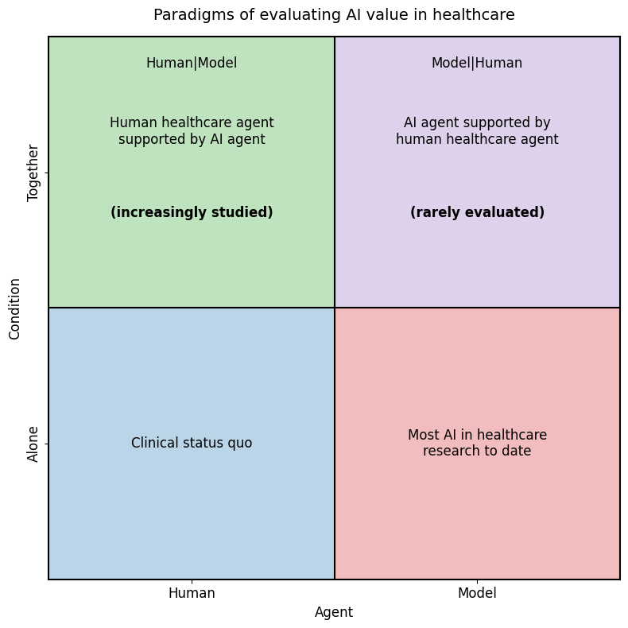
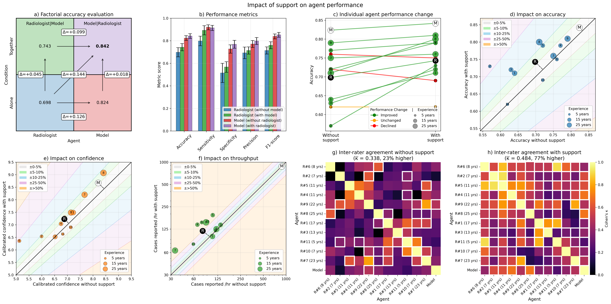

# Bidirectional human–AI collaboration in brain tumour imaging assessments

[](https://arxiv.org/abs/2512.19707)
[](LICENSE)

Reproducibility package for *"Bidirectional human-AI collaboration in brain tumour imaging assessments improves both expert human and AI agent performance"* (Ruffle et al.; manuscript under review at Nature Communications).

[Preprint on arXiv: 2512.19707](https://arxiv.org/abs/2512.19707)

## At a glance

**Paradigms of evaluating AI value in healthcare.** A two-by-two framing of
how AI is studied in healthcare today: most prior work sits in the lower-right
(model alone), while bidirectional collaboration — particularly the
upper-right "Model | Human" formulation in which the AI is supported by the
human — is rarely evaluated.



**Impact of support on agent performance.** Headline results across the
564-case radiologist-reviewed cohort: factorial accuracy evaluation,
condition-wise performance metrics, individual agent performance change,
impact of support on accuracy, confidence and throughput, and inter-rater
agreement.



## Repository layout

```
code/_metrics_utils.py  Shared analysis helpers used by every figure + table script
                        (per-reader metrics, optimistic-dedup, case-level ensembles,
                        calibration, equivalent-experience regression).
code/figures/           One self-contained Python script per published figure.
code/tables/            One script per Table 1 / supplementary table.
code/run_all.sh         Parallel runner — executes every figure and table script
                        concurrently with timing captured in each log.
data/source_data/       CSV / JSON inputs consumed by the figure / table scripts.
data/figures/           Reproduced PNG + SVG outputs from running the scripts.
data/logs/              stdout captured from each script (numerical values printed
                        in figure captions and table cells are reproducible from
                        these; each log header records start timestamp + host CPU
                        count, and the trailing line records the wall clock).
figures/                Static, non-script-reproducible figures referenced from
                        this README (e.g. the EDF 1 paradigm illustration).
```

## Running figures and tables

Every figure and table is regenerated **live from the bundled CSVs** — no static aggregate caches. Shared analysis logic (per-reader metrics, optimistic-dedup, case-level ensembles, paired bootstrap deltas) lives in `code/_metrics_utils.py` and is imported by both the figure and table scripts, so every printed value is traceable to a Python computation on the CSV inputs in `data/source_data/`.

The repo includes a parallel runner that runs everything concurrently and writes a timed log under `data/logs/<script>.log`:

```bash
bash code/run_all.sh             # all 8 figure scripts + 4 table scripts in parallel
bash code/run_all.sh figures     # figures only
bash code/run_all.sh tables      # tables only
```

To run a single script:

```bash
python3 code/figures/fig_1.py 2>&1 | tee data/logs/fig_1.log
```

PNG outputs are byte-identical across runs; SVG outputs may differ by matplotlib metadata only.

## Expected runtimes (128-CPU host, parallel)

Most scripts complete in a few seconds. `extended_data_fig_4.py` is the longest path because it runs five 5,000-iter Cohen's κ bootstraps over the inter-rater agreement contrasts — that script alone takes ~15 minutes on a single core. `fig_1.py` and `table_1.py` each do ~40 s of paired bootstrap work for the Δ-metric CIs.

When run through `code/run_all.sh` on a multi-core host, total wall clock is **bounded by the slowest script (~15 min)** — every other script finishes inside that window. See the `data/logs/*.log` files for measured wall-clock times.

## Source-data layout

| Script | Reads from |
|---|---|
| `fig_1.py` | `data/source_data/figure_1/csv_v2/` |
| `fig_4.py` | `data/source_data/figure_4/csv/` |
| `fig_5.py` | `data/source_data/figure_5/csv/` |
| `fig_6.py` | `data/source_data/figure_6/` |
| `extended_data_fig_4.py` | `data/source_data/extended_data_figure_4/` |
| `extended_data_fig_5.py` | `data/source_data/extended_data_figure_5/csv/` |
| `extended_data_fig_6.py` | `data/source_data/extended_data_figure_6/csv/` |
| `extended_data_fig_7.py` | `data/source_data/extended_data_figure_7/` |

See `code/figures/README.md` for a more detailed breakdown of the inputs.

## Figures *not* in this repository

Brain-image figures (Fig. 2, Fig. 3) and the schematic figures (Extended Data
Figures 1–3) are not script-reproducible — they depend on raw NIfTI imaging
held under controlled access, or are designed manually. The manuscript versions
remain canonical.

## Dependencies

All software dependencies and operating systems (including version numbers)
used to produce the published figure outputs and stdout logs in this
repository:

- Operating system: Ubuntu 22.04.5 LTS (Jammy Jellyfish), Linux kernel 6.8
- Python: 3.10.12
- numpy: 1.26.4
- pandas: 2.2.3
- matplotlib: 3.10.1
- seaborn: 0.13.2
- scipy: 1.15.2

No GPU or specialist medical-imaging libraries are required for any of the
figure scripts in this repository. The full upstream analysis (model training
and held-out evaluation) was performed under the same Python environment with
additional dependencies listed in the manuscript Methods.

## Patient privacy

All bundled data is de-identified. Case identifiers use cohort-prefixed
pseudonyms (e.g. `NHNN_1426`, `BraTS-MEN-00840-000`, `UCSF-PDGM-0449`). No
patient names, dates of birth, addresses, or other HIPAA-listed identifiers
are present.

## Citation

If you use this code or the bundled data, please cite:

```bibtex
@article{ruffle2026bidirectional,
  title={Bidirectional human-AI collaboration in brain tumour imaging assessments improves both expert human and AI agent performance},
  author={Ruffle, James K and Mohinta, Samia and Pombo, Guilherme and Biswas, Asthik and Campbell, Alan and Davagnanam, Indran and Doig, David and Hammam, Ahmed and Hyare, Harpreet and Jabeen, Farrah and Lim, Emma and Mallon, Dermot and Owen, Stephanie and Wilkinson, Sophie and Brandner, Sebastian and Nachev, Parashkev},
  journal={arXiv preprint arXiv:2512.19707},
  year={2026}
}
```

## Funding

JKR is supported by the [Medical Research Council](https://www.ukri.org/councils/mrc/) (MR/X00046X/1 & UKRI1389), the [British Society of Neuroradiology](https://www.bsnr.org.uk/), and the [European Society of Radiology (ESR)](https://www.myesr.org/) in collaboration with the [European Institute for Biomedical Imaging Research (EIBIR)](https://www.eibir.org/). HH and JKR are supported by the [National Brain Appeal](https://www.nationalbrainappeal.org/). PN is supported by the [Wellcome Trust](https://wellcome.org/) (213038/Z/18/Z). JKR, PN and HH are supported by the [UCLH NIHR Biomedical Research Centre](https://www.uclhospitals.brc.nihr.ac.uk/).

## License

This project is licensed under the Apache License 2.0 — see the [LICENSE](LICENSE) file for details.

## Contact

For questions about the code or the bundled data, please open an issue on GitHub or contact the corresponding author, [Dr James K. Ruffle](mailto:j.ruffle@ucl.ac.uk).
