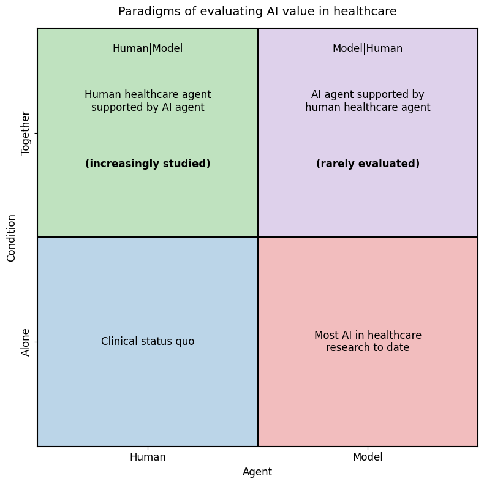
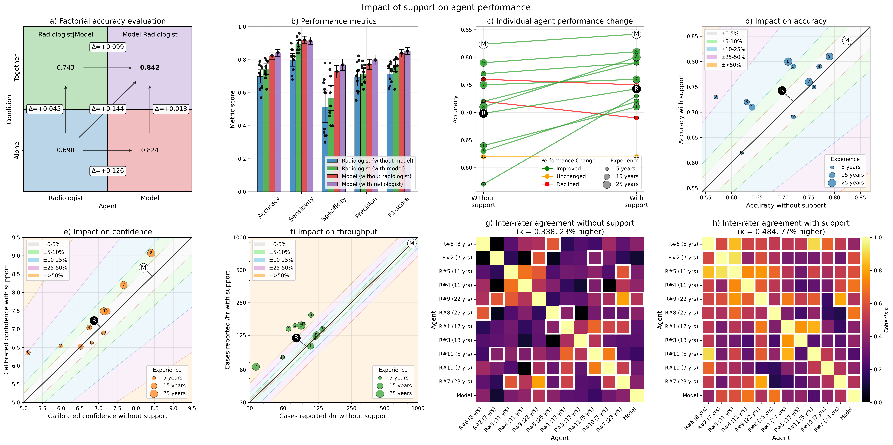

# Bidirectional human–AI collaboration in brain tumour imaging assessments

[](https://arxiv.org/abs/2512.19707)
[](LICENSE)

Reproducibility package for *"Bidirectional human-AI collaboration in brain tumour assessment improves both expert human and AI agent performance"* (Ruffle et al., Nature Communications, 2026, in press).

[Preprint on arXiv: 2512.19707](https://arxiv.org/abs/2512.19707)

## At a glance

**Paradigms of evaluating AI value in healthcare.** A two-by-two framing of
how AI is studied in healthcare today: most prior work sits in the lower-right
(model alone), while bidirectional collaboration — particularly the
upper-right "Model | Human" formulation in which the AI is supported by the
human — is rarely evaluated.



**Impact of support on agent performance.** Headline results across the
564-case radiologist-reviewed cohort: factorial accuracy evaluation,
condition-wise performance metrics, individual agent performance change,
impact of support on accuracy, confidence and throughput, and inter-rater
agreement.



## Repository layout

```
code/_metrics_utils.py  Shared analysis helpers used by every figure + table script
                        (per-reader metrics, prefer-correct dedup, case-level ensembles,
                        calibration, equivalent-experience regression).
code/figures/           One self-contained Python script per published figure.
code/tables/            One script per Table 1 / supplementary table.
code/analysis/          Standalone diagnostic analyses that support statements in
                        the manuscript without producing a published figure or
                        table (e.g. the experience x assistance interaction and
                        its power/MDE calculation).
code/run_all.sh         Parallel runner — executes every figure, table, and
                        analysis script concurrently with timing captured in
                        each log.
code/regenerate_seed_predictions.py
                        Internal bridge script that rebuilds seed_predictions.csv
                        from the canonical CV cache. Requires a non-bundled
                        data/cv_cache_backup/*.pkl.original input; users do not
                        need to run this (seed_predictions.csv is already bundled).
data/source_data/       CSV / JSON inputs consumed by the figure / table scripts.
data/figures/           PNG outputs from running the scripts (SVG/PDF are
                        written too but not tracked), plus the Supplementary
                        Figure 1 schematic (rendered image only).
data/logs/              stdout captured from each script (numerical values printed
                        in figure captions and table cells are reproducible from
                        these; each log header records start timestamp + host CPU
                        count, and the trailing line records the wall clock).
```

## Running figures, tables, and analyses

Every figure and table is regenerated **live from the bundled CSVs** — no static aggregate caches. Shared analysis logic (per-reader metrics, prefer-correct dedup, case-level ensembles, paired bootstrap deltas) lives in `code/_metrics_utils.py` and is imported by both the figure and table scripts, so every printed value is traceable to a Python computation on the CSV inputs in `data/source_data/`.

The repo includes a parallel runner that runs everything concurrently and writes a timed log under `data/logs/<script>.log`:

```bash
bash code/run_all.sh             # all 8 figure + 4 table + 1 analysis script in parallel
bash code/run_all.sh figures     # figures only
bash code/run_all.sh tables      # tables only
bash code/run_all.sh analysis    # standalone analyses only
```

To run a single script:

```bash
python3 code/figures/fig_1.py 2>&1 | tee data/logs/fig_1.log
```

Only the PNG outputs are tracked in git (they are byte-identical across runs). Each script also writes an SVG, and the main-figure scripts a PDF, alongside the PNG; these are regenerated on every run and are gitignored to keep the repository small.

## Expected runtimes (128-CPU host, parallel)

Most scripts complete in a few seconds. `supplementary_figure_4.py` is the slowest by
a wide margin: it runs the Cohen's κ contrast bootstraps at **B = 5,000,000**
(`supplementary_figure_4.py:278`), computing κ from per-case 2×2 counts as chunked
matrix products rather than one `sklearn` call per replicate, and takes **~217 s**.
`fig_1.py` (~47 s) and `table_1.py` (~44 s) each do paired bootstrap work for the
Δ-metric CIs.

`code/run_all.sh` deliberately runs `supplementary_figure_4.py` to completion *before*
the parallel block, because `table_1.py` reads the κ row from its log. Total wall
clock is therefore **~217 s + the slowest remaining script (~47 s) ≈ 265 s**, not the
duration of the parallel block alone. The bundled `data/logs/*.log` files record the
measured wall-clock time of every script.

## Naming

Repository names match the published names. At acceptance the journal renamed the
Extended Data items to **Supplementary Figures 1–7**, and the repository followed:
scripts, rendered outputs, logs and source-data directories all carry the
`supplementary_figure_*` / `Supplementary_Figure_*` form, so a published item and the
artefact that produces it share a name.

| Published name | Repository artefact |
|---|---|
| Supplementary Figures 1–3 | schematics; only Supplementary Figure 2 has deposited source (`code/figures/human_ai_paradigm.jsx`) |
| Supplementary Figure 4 | `code/figures/supplementary_figure_4.py` → `data/figures/Supplementary_Figure_4.png` |
| Supplementary Figure 5 | `code/figures/supplementary_figure_5.py` → `data/figures/Supplementary_Figure_5.png` |
| Supplementary Figure 6 | `code/figures/supplementary_figure_6.py` → `data/figures/Supplementary_Figure_6.png` |
| Supplementary Figure 7 | `code/figures/supplementary_figure_7.py` → `data/figures/Supplementary_Figure_7.png` |
| Supplementary Table 1 | reader subspecialty roster (no script) |
| Supplementary Table 2 | `code/tables/supplementary_table_3.py` |
| Supplementary Table 3 | `code/tables/supplementary_table_4.py` |
| Supplementary Data 1 | `code/tables/supplementary_table_2.py` |

The supplementary **tables** are the one exception, and the offset is deliberate. The
geography × pathology table became Supplementary Data 1 at acceptance rather than a
numbered table, so the published Supplementary Table *N* is produced by
`supplementary_table_`*N+1*`.py`. Those filenames are left unchanged: they are recorded in
the bundled logs and in the source-data directory names, and renaming them would make the
same filename refer to two different objects either side of a single commit.

## Source-data layout

| Script | Reads from |
|---|---|
| `fig_1.py` | `data/source_data/figure_1/csv_v2/` |
| `fig_4.py` | `data/source_data/figure_4/csv/` |
| `fig_5.py` | `data/source_data/figure_1/csv_v2/radiologist_df.csv` |
| `fig_6.py` | `data/source_data/figure_6/` (+ `data/source_data/figure_1/csv_v2/radiologist_df.csv`) |
| `supplementary_figure_4.py` | `data/source_data/figure_1/csv_v2/radiologist_df.csv` |
| `supplementary_figure_5.py` | `data/source_data/supplementary_figure_5/csv/` |
| `supplementary_figure_6.py` | `data/source_data/supplementary_figure_6/csv/` |
| `supplementary_figure_7.py` | `data/source_data/supplementary_figure_7/` |

See `code/figures/README.md` for a more detailed breakdown of the inputs.

## Figures *not* in this repository

Brain-image figures (Fig. 2, Fig. 3) are not script-reproducible — they depend
on raw NIfTI imaging held under controlled access. The manuscript versions remain
canonical.

The schematic figures (Supplementary Figures 1–3) are not generated by the
analysis pipeline. Supplementary Figure 2 is the exception to "no source": it is
a React component, `code/figures/human_ai_paradigm.jsx`, rendered in a browser and
captured; its source is deposited here so the figure is reproducible. Its
pictograms are from the open-source Lucide icon set (`lucide-react`), used under
the ISC licence. Supplementary Figures 1 and 3 ship as rendered images only.

## Dependencies

All software dependencies and operating systems (including version numbers)
used to produce the published figure outputs and stdout logs in this
repository:

- Operating system: Ubuntu 22.04.5 LTS (Jammy Jellyfish), Linux kernel 6.8
- Python: 3.10.12
- numpy: 1.26.4
- pandas: 2.2.3
- matplotlib: 3.10.9
- scikit-learn: 1.6.1
- seaborn: 0.13.2
- scipy: 1.15.2
- statsmodels: 0.14.6
- joblib: 1.4.2
- Pillow: 11.1.0

No GPU or specialist medical-imaging libraries are required for any of the
figure scripts in this repository. The full upstream analysis (model training
and held-out evaluation) was performed under the same Python environment with
additional dependencies listed in the manuscript Methods.

## Patient privacy

All bundled data is de-identified. Case identifiers use cohort-prefixed
pseudonyms (e.g. `NHNN_1426`, `BraTS-MEN-00840-000`, `UCSF-PDGM-0449`). No
patient names, dates of birth, addresses, or other HIPAA-listed identifiers
are present.

## Citation

If you use this code or the bundled data, please cite:

```bibtex
@article{ruffle2026bidirectional,
  title={Bidirectional human-AI collaboration in brain tumour assessment improves both expert human and AI agent performance},
  author={Ruffle, James K and Mohinta, Samia and Pombo, Guilherme and Biswas, Asthik and Campbell, Alan and Davagnanam, Indran and Doig, David and Hammam, Ahmed and Hyare, Harpreet and Jabeen, Farrah and Lim, Emma and Mallon, Dermot and Owen, Stephanie and Wilkinson, Sophie and Brandner, Sebastian and Nachev, Parashkev},
  journal={Nature Communications},
  year={2026},
  note={in press; preprint at arXiv:2512.19707}
}
```

The archived version of this repository is citable by its Zenodo DOI, given in the
paper's Code availability statement and on the repository's GitHub page.

## Funding

JKR is supported by the [Medical Research Council](https://www.ukri.org/councils/mrc/) (MR/X00046X/1 & UKRI1389), the [British Society of Neuroradiology](https://www.bsnr.org.uk/), and the [European Society of Radiology (ESR)](https://www.myesr.org/) in collaboration with the [European Institute for Biomedical Imaging Research (EIBIR)](https://www.eibir.org/). HH and JKR are supported by the [National Brain Appeal](https://www.nationalbrainappeal.org/). PN is supported by the [Wellcome Trust](https://wellcome.org/) (213038/Z/18/Z). JKR, PN and HH are supported by the [UCLH NIHR Biomedical Research Centre](https://www.uclhospitals.brc.nihr.ac.uk/).

## License

This project is licensed under the Apache License 2.0 — see the [LICENSE](LICENSE) file for details.

## Contact

For questions about the code or the bundled data, please open an issue on GitHub or contact the corresponding author, [Dr James K. Ruffle](mailto:j.ruffle@ucl.ac.uk).
